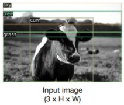
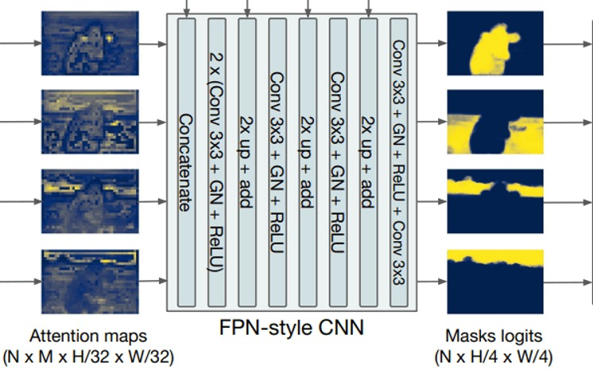

# Capstone Project - Panoptic Segmentation
## Part 1:
## Questions:
 * We take the encoded image (dxH/32xW/32) and send it to Multi-Head Attention (FROM WHERE DO WE TAKE THIS ENCODED IMAGE?)
 * We also send dxN Box embeddings to the Multi-Head Attention
 * We do something here to generate NxMxH/32xW/32 maps. (WHAT DO WE DO HERE?)
 * Then we concatenate these maps with Res5 Block (WHERE IS THIS COMING FROM?)
 * Then we perform the above steps (EXPLAIN THESE STEPS)
 * And then we are finally left with the panoptic segmentation
 
 ## Q1 - We take the encoded image (dxH/32xW/32) and send it to Multi-Head Attention (FROM WHERE DO WE TAKE THIS ENCODED IMAGE?)
 
  Here in the notation d X H/32 X W/32, H is the height of the encoded image and W is the width of the encoded image and d is the number of channels. Encoded image is the
  result of passing the input image through the flattened Resnet-50 block without fully connected layers. The dimension of the output of this Resnet-50 block is(d X H/32 X W/32)
  where input is the image of dimension (3 X H X W).
  i.e 
                              
            Input Image(3 X H X W) ------> RESNET-50(No FCL) ------> output(d X H/32 X W/32) 
                        
  The output from the Resnet-50 block is reduced before sent as an imput to the encoder model because the encoder expects a 1-Dimensional Input. To better Understand 
  this process let us say the imput image is a color image of dimension (3 X H X W), now this image is sent to the flattened Resnet-50 blok to get output of dimension
  (H/32 X W/32 X 2048). Now before this output is fed to the encoder it is reduced to (H/32 X W/32 X 256)dimensions in 1-Dimension. 
  
  
  
     2048 X H/32 X W/32 --(Reduced)--> H/32 X W/32 X 256 ----->  Multi-Head Attention           N X M X 
                                       Box Embeddings    ----->  model (8 heads in DeTr) ---->  H/32 X W/32
                                                                                              (Attention Maps)
                                                                                  
  
  
  This modified 1-D imput is sent ot the encoder and the this encoder model processes the positional and patch embeddings. The encoder is combination of multi-head attention
  networks and the output of the encoder i.e the encoded image is further sent to the decoder model along with object queries. So, we get the encoded image as an output of
  the input image sent throught the flattened Resnet-50 block and 1-D compression.
  
 
 ## Q2 - We do something here to generate NxMxH/32xW/32 maps. (WHAT DO WE DO HERE?)
 
  * Here We generate attention maps of dimension  N X M X H/32 X W/32, where
    * H an W are the height and width of the original image respectively.
    * N is the number of box embeddings generated. 
    * M is D/N where D is the number of channels passed in the encoded image.
   
   * Decoder has two imputs, one is the encoded images and the also the object queries or box embeddings. These box embeddings are used to locate the bounding boxes 
   based on the attention. THe decoder trains the model to locate the exact position of bounding boxesusing the bipartite matching between the set of actual values and
   the predicted values. 
   
   * Once the decoder is trained to generate the bounding boxes, we need to pass and create the head maps of each object located within the bounding box. We
   can observe bounding boxes all over the image as we are considering all the objects and the background parts in the image.
   
   
   * If observed in the below Image there are bounding boxes generated using object embedding and encoder-decoder model. Now these bounding boxes arepassed to the head maps 
     generated from the backbone structure and train to generate segmentation scales on the bounding box of each image seperately  and combine them later. 
     
   
          
     
     
   
 
 
 ## Q3 - Then we concatenate these maps with Res5 Block (WHERE IS THIS COMING FROM?)
 
  * The activation maps are extracted from the layer 2,3,4, and 5 layers of the resnet block. 
  * The attention maps get sampled from the  N X M X H/32 X W/32  to  N X h/4 X W/4 by passing it repeatedly through Resnet layer and we get desired segmentation scale image.
  * Each bounding box and its corresponding class activation maps are passed to train in order to generate the segmentation scale for a class based on the bounding box and
      activation map.
      As per the below Image with 4 bounding boxes there are 4 attention maps generated. 
      
       
      
       
      
      The Resnet block stores the activation maps of the classes and is used to train over the bounding box to generate the mask logits for each bounding box which is nothing 
      but the segementation scale of the particular bounding box.
 
 
  
 
 
 
 ## Q4 - Then we perform the above steps (EXPLAIN THESE STEPS) And then we are finally left with the panoptic segmentation.
 
  
 
  The above Image shows the whole process pipeline for panoptic segmentation using DETR(Detection Transformer)
  
  * Initially we have a Resenet-50 backbone to generate 1-Dimensional output which acts as 1-D sequential imput to the encoder.
  * Multiple heads and attention is applied to the 1-D data ((H/32 X W/32) X D).
  * Then Encoded image along with object queries or box embeddings is sent to the decoder.
  * Decoder with 8 heads applies the attention on the combined input and in result genertes the bounding boxes all over the image.
  * Since we are considering bothe the backgroung image and the objects in the image, the resultant image will be covered with bounding boxes.
  * The maximum number of bounding boxes in an image can be 100 as the dimension of the box embeddings is 100. There are equal number of attention maps generated as that of number 
    of bounding boxes.
  * The generated attention maps and the stored activation maps along with bounding boxes and class  helps in training the model to generate the segmentation scale  for the 
    particular class in the bounding box.
  * These individual segmentation scales are later concatenated to generate final panoptic segmented image.
 
 
 ## MY NEXT STEPS
 Here are my next tentative steps to proceed forward with the upcoming parts of the capstone project. 
 
 * Get the dataset ready and convert it into COCO format.
 * Train a model on the dataset to predict bounding boxes of all the background and normal objects in the image.
 * Setup the Resnet block.
 * store the weights of the predicted bounding boxes.
 * In order to avoid overlaps between the bounding boxes apply masking.
 * Now train the model to generate segmentation scale on these images with bounding boxes by generating attention maps over resnet. 
 * For the final panoptic segmented image concatenate all the generated attention maps.
 
 This is the idea that I have now in regrads to how to proceed further on the project, These steps may change as I continue to learn. Thank you.
 
 
 
 ## Contributor
  * Nandam Sriranga Chaitanya(nandams@oregonstate.edu)
 
 
 
   
